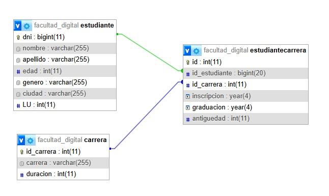

# ArqWeb2 – Ejercicio integrador (JPA + Hibernate)

Trabajo práctico de Arquitectura Web que modela un registro de estudiantes y sus carreras usando JPA con Hibernate como ORM y MySQL como base de datos. Los datos iniciales se cargan desde archivos CSV y se consultan mediante JPQL.

## Modelo de datos

El diagrama entidad-relación:

 

Las entidades se corresponden con los tres CSV de entrada:

- Carrera: id_carrera (PK), carrera, duracion
- Estudiante: dni (PK), nombre, apellido, edad, genero, ciudad, LibretaUniversitaria
- EstudianteCarrera: id (PK), id_estudiante (FK), id_carrera (FK), inscripcion, graduacion, antiguedad

Un estudiante puede cursar varias carreras y una carrera tiene varios estudiantes; EstudianteCarrera guarda la información de cada inscripción (año de inscripción, graduación y antigüedad).
